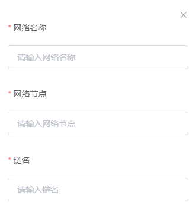
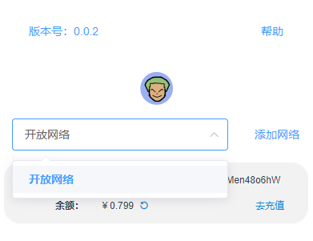
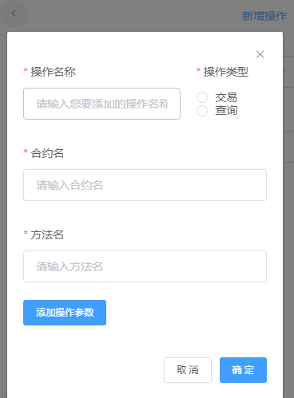
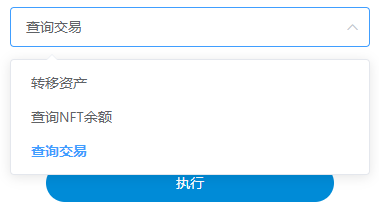

# OpenNFT 浏览器插件(谷歌浏览器或 Chromium 内核)

## 前期准备

### 注册百度账号以及获取私钥


### 充值百度开放网络

`Tip:用户地址下需要有百度开放网络余额才能使用转移资产，查询余额等功能。建议在百度开放网络充值0.1元。充值链接：`https://xuper.baidu.com/n/console#/finance/wallet/recharge


## 插件使用

使用帮助二维码


### 插件安装

插件已放置根目录下()

国内加速下载 https://gitee.com/shengjian-tech/opennft-client/raw/master/MakerONE.zip

1，浏览器选择管理扩展程序


2，首先打开开发者模式，然后解压下载的压缩包并选择加载，此时您可以看到浏览器已经安装好该插件了


3，您可以选择插件常驻


### 插件登录

下载私钥到本地之后，打开浏览器插件进入登录页，选择本地私钥，输入安全码登录：


### 用户首页

> 登录之后跳转到首页，显示目前处于百度开放网络，用户百度开放网络地址，余额。以及功能等。


### 查询资产余额：


### 转移资产：


### 查询交易：


### 新增网络：




### 新增自定义操作：





# 整体设计：

## 登录页

- 本地私钥路径：需要用户选择本地私钥存放路径，读取私钥内容。
- 安全码（可选）（6 位数）：根据超级链生成账户的方式可选。开放网络必填。

## js 代码：

转换开放网络地址为 EVM 地址的工具类 `addressUtils.js`

```js
import base58 from 'bs58'
import { sha256 } from 'js-sha256'
export function XchainAddrToEvm(addr) {
  var result = ''
  try {
    // 判断是否是合约账号;判断合约账户地址仅支持 XC11111111111@xuper, xuper后缀，go-sdk有相同问题。
    if (determineContractAccount(addr)) {
      result = contractAccountToEVMAddress(addr)
    } else if (determineContractName(addr)) {
      result = contractNameToEVMAddress(addr)
    } else {
      result = xchainAKToEVMAddress(addr)
    }
    return result
  } catch (err) {
    console.log(err)
  }
}
// 判断合约账户地址仅支持 XC11111111111@xuper, xuper后缀，go-sdk有相同问题。
function determineContractAccount(xchainAddr) {
  if (isAccount(xchainAddr) != 1) {
    return false
  }
  return xchainAddr.indexOf('@xuper') != -1
}

const accountPrefix = 'XC'
function isAccount(name) {
  if (name == '') {
    return -1
  }
  if (name.indexOf(accountPrefix) != 0) {
    return 0
  }
  var prefix = name.split('@')[0]
  prefix = prefix.substr(accountPrefix.length)
  if (!validRawAccount(prefix)) {
    return 0
  }
  return 1
}

const accountSize = 16
function validRawAccount(accountName) {
  if (accountName == '') {
    return false
  }
  if (accountName.length != accountSize) {
    return false
  }
  for (var i = 0; i < accountSize; i++) {
    if (accountName[i] >= '0' && accountName[i] <= '9') {
      continue
    } else {
      return false
    }
  }
  return true
}
const contractAccountPrefixs = '1112'
const Word160Length = 20
function contractAccountToEVMAddress(contractAccount) {
  var contractAccountValid = contractAccount.slice(2, 18)
  var str = contractAccountPrefixs.concat(contractAccountValid)
  if (str.length != Word160Length) {
    throw new Error('slice passed as address shou have 20 byte length')
  }
  return Buffer.from(str).toString('hex').toUpperCase()
}

const contractNameMaxSize = 16
const contractNameMinSize = 4
const contractNameRegex = /^[a-zA-Z_]{1}[0-9a-zA-Z_.]+[0-9a-zA-Z_]$/

function determineContractName(xchainAddr) {
  var contractSize = xchainAddr.length
  if (
    contractSize > contractNameMaxSize ||
    contractSize < contractNameMinSize
  ) {
    return false
  }
  if (!contractNameRegex.test(xchainAddr)) {
    return false
  }
  return true
}

const evmAddressFiller = '-'
const contractNamePrefixs = '1111'
function contractNameToEVMAddress(contractName) {
  var contractNameLength = contractName.length
  var prefixStr = ''
  for (var i = 0; i < Word160Length - contractNameLength - 4; i++) {
    prefixStr += evmAddressFiller
  }
  contractName = prefixStr + contractName
  contractName = contractNamePrefixs + contractName

  if (contractName.length != Word160Length) {
    throw new Error('slice passed as address shou have 20 byte length')
  }
  return Buffer.from(contractName).toString('hex').toUpperCase()
}

function xchainAKToEVMAddress(xchainAddr) {
  var rawAddr = base58.decode(xchainAddr)
  if (rawAddr.length < 21) {
    throw new Error('bad address')
  }
  rawAddr = rawAddr.slice(1, 21)
  return Buffer.from(rawAddr, '').toString('hex').toUpperCase()
}

export function EvmToXchainAddr(addr) {
  // return addr, addrType, nil
  var result = ''
  try {
    var bs = Buffer.from(addr, 'hex').toString('ascii')
    if (bs.length != Word160Length) {
      throw new Error('slice passed as address shou have 20 byte length')
    }
    var evmAddrStrWithPrefix = bs
    // 合约账号
    if (evmAddrStrWithPrefix.slice(0, 4) == contractAccountPrefixs) {
      result = evmAddressToContractAccount(bs)
    } else if (evmAddrStrWithPrefix.slice(0, 4) == contractNamePrefixs) {
      result = evmAddressToContractName(bs)
    } else {
      var buffer = Buffer.from(addr, 'hex')
      result = evmAddressToXchain(buffer)
    }
    return result
  } catch (err) {
    console.log(err)
  }
}
function evmAddressToContractAccount(addr) {
  return accountPrefix + addr.slice(4) + '@xuper'
}
function evmAddressToContractName(addr) {
  var index = addr.lastIndexOf(evmAddressFiller)
  return addr.slice(index + 1)
}

function evmAddressToXchain(addr) {
  var addTyepe = []
  var addrArray = new Uint8Array(addr)
  addTyepe.push(1)
  for (var i = 0; i < addrArray.length; i++) {
    addTyepe.push(addrArray[i])
  }
  var checkCode = DoubleSha256(addTyepe)
  var simpleCheckCode = checkCode.slice(0, 4)
  for (var i = 0; i < simpleCheckCode.length; i++) {
    addTyepe.push(simpleCheckCode[i])
  }
  return base58.encode(addTyepe)
}

// DoubleSha256 执行2次SHA256，这是为了防止SHA256算法被攻破。
function DoubleSha256(data) {
  return UsingSha256(UsingSha256(data))
}

// UsingSha256 get the hash result of data using SHA256
function UsingSha256(data) {
  return sha256.array(data)
}
```

```js
// 需要引入 XuperSDK 和上面的地址转换工具类
import XuperSDK, { Endorsement } from '@xuperchain/xuper-sdk'
import { XchainAddrToEvm } from './addressUtils'

// TODO 需要通过用户选择的私钥路径，读取出来私钥的内容
const private = ''
// 安全码
const password = ''
// 登录后 生成 账户对象
const acc = xsdk.import(password, private)
```

## 首页

- 默认首页用户处于开放网络。 开放网络为下拉框，默认一个位开放网络。用户可以添加网络。添加网络可以弹框，需要参数：网络名（用户自己输入就行），节点 IP（例如：39.156.69.83:37100）,链名：（例如 xuperchain), **Vue 里面开放网络的 node 需要设置为https://xuper.baidu.com/nodeapi**

  ```js
  // 默认就有的开放网络，默认开放网络的链名
  const node = '39.156.69.83:37100' // vue里面设置为 https://xuper.baidu.com/nodeapi
  const chain = 'xuper'

  // 连接开放网络时需要加载背书服务，
  const params = {
    server: '39.156.69.83:37100', // ip, port // vue里面设置为 https://xuper.baidu.com/nodeapi
    fee: '400', // fee
    endorseServiceCheckAddr: 'jknGxa6eyum1JrATWvSJKW3thJ9GKHA9n', // sign address
    endorseServiceFeeAddr: 'aB2hpHnTBDxko3UoP2BpBZRujwhdcAFoT', // fee address
  }
  // 默认的开放网络 SDK client, 后续查询余额，调用合约使用。
  const xsdk = new XuperSDK({
    node,
    chain,
    plugins: [
      Endorsement({
        transfer: params,
        makeTransaction: params,
      }),
    ],
  })

  // 用户新增网络可以生成新的sdk client并记录，切换网络即切换SDK，新增网络暂时不考虑背书插件，仅传入IP和链名即可
  const xsdk = new XuperSDK({
    node,
    chain,
  })
  ```

- 显示用户 Address

  ```js
  // 用户登录时生成的acc, acc.address即为用的address地址
  const addr = acc.address
  ```

- 显示用户余额

  ```js
  // 查询登录用户余额
  // 用户超级链账户余额 address 直接传入上面 acc.address即可。
  const balance = async (adress) => {
    try {
      const result = await xsdk.getBalance(adress)
      debug(result.bcs[0].balance)
    } catch (err) {
      throw err
    }
  }
  ```

- 默认提供三个 Action 功能，转移 NFT。查询 NFT 数量，查询交易。并提供新增 Action 操作

- 点击功能，跳转到功能页。最上面为下拉框，用户可以选择功能，默认为上述三个，并且有一个新增操作。

- 默认三个功能 转移，查询，查询交易

  ```js
  // 默认合约名
  const contractName = 'opennft'
  // 默认方法名
  const methodName = 'safeTransferFrom'
  // 默认参数
  // nft 转移发起者，默认取值 acc.address，acc.address需要转换，下述为转换好的。
  // acc.address 格式为 ULuqhymLPGidfihUb683i2TH4qtaqZ2Dz 需要用工具类转换为evm的地址2BEF68690AE24553824BA37C003C2B9067665F81
  const from = XchainAddrToEvm(acc.address)

  // 下述三个参数，需要用户在页面输入，提供三个输入框即可。
  // nft 转移接受者 前端输入 例如 cRsoDDnDX1NjhzJtNKLS3GHudBsgyRouQ 也需要转换
  const to = XchainAddrToEvm('cRsoDDnDX1NjhzJtNKLS3GHudBsgyRouQ')
  // 转移的 nft token id
  const nftTokenID = '6'
  // 转移数量
  const amount = '1'

  // 转移NFT  转移操作前先查询一下账户余额。是0的话让他去充值。建议最少充值一元。
  // 咱们默认提供的NFT 转移，只需要转移着的地址，tokenid，数量。给用户返回交易ID
  const TransferNFTEvm = async (toAddr, TokenID, Amount) => {
    try {
      const contractName = contractName
      const methodName = methodName
      const demo = await xsdk.invokeSolidityContarct(
        contractName,
        methodName,
        'evm',
        {
          from: from,
          to: to,
          id: nftTokenID,
          amount: amount,
          data: '',
        },
        '0',
        acc
      )
      // 352cd3f829dded7ad1da7ab3a0c3a8776cd3ec545c617ad499abb2d29459c6ee  // 交易ID 返回给用户
      debug(xsdk.transactionIdToHex(demo.transaction.txid))
      const result = await xsdk.postTransaction(demo.transaction, acc)
      // TODO 调用转移操作成功后
      // TODO 调用坤那边的服务端接口解析交易 只传输txid，调用接口即可，后续不管。最后给用户返回上面的交易ID就行。
      debug(result)
      // err 是空 证明转移成功，不是 就是执行失败。
    } catch (err) {
      console.log(err)
    }
  }
  ```

- 查询自己的 NFT 余额

  ```js
  // 查询  NFT 余额 前端用户选择查询资产余额，需要输入NFT token ID 就行，然后返回余额数量就OK。
  const queryNFTBalance = async (tokenID) => {
    try {
      const contractName = 'opennft'
      const methodName = 'balanceOf'
      const args = {
        account: XchainAddrToEvm(acc.address),
        id: tokenID,
      }
      const demo = await xsdk.invokeSolidityContarct(
        contractName,
        methodName,
        'evm',
        args,
        '0',
        acc
      )
      // 判断  demo.preExecutionTransaction.response.responses的长度是否大于0， 大于0 取demo.preExecutionTransaction.response.responses[length - 1]
      const len = demo.preExecutionTransaction.response.responses.length
      if (len > 0) {
        const str =
          demo.preExecutionTransaction.response.responses[len - 1].body
        const result = Buffer.from(str, 'base64').toString('ascii')
        // [{\"0\":\"10\"}]  result 即为 [{\"0\":\"10\"}]  10即为想要的结果，即对应nft 的余额
        debug(result)
      }
    } catch (err) {
      console.log(err)
    }
  }
  ```

- 查询交易信息

  ```js
  // 查询交易 前端用户选择查询交易，让用户输入交易ID，即可，返回交易信息。目前交易信息很少
  // 查询交易
  const GetTxDetail = async (txID) => {
    try {
      const demo = await xsdk.queryTransaction(
        Buffer.from(txID, 'hex').toString('base64')
      )
      if (demo.tx == undefined) {
        // 证明此交易链上没有 直接报错
        throw new Error('this tx undefined')
      }
      // 交易ID
      var txID = Buffer.from(demo.tx.txid, 'base64').toString('hex')
      var txReqJson = JSON.parse(
        Buffer.from(
          demo.tx.contract_requests[1].args.input,
          'base64'
        ).toString()
      )
      var from = ''
      var to = ''
      var tokenID = ''
      var amount = ''
      if (demo.tx.contract_requests[1].method_name == 'safeTransferFrom') {
        from = EvmToXchainAddr(txReqJson.from)
        to = EvmToXchainAddr(txReqJson.to)
        tokenID = txReqJson.id
        amount = txReqJson.amount
      } else {
        from = demo.tx.initiator
        tokenID = txReqJson._id
        amount = txReqJson._initialSupply
      }

      // 根据 tokenID 查询token id的图片路径 供浏览器跳转
      const contractName = 'opennft'
      const methodName = 'getTokenBytes'
      const args = {
        _id: tokenID,
      }
      const res = await xsdk.invokeSolidityContarct(
        contractName,
        methodName,
        'evm',
        args,
        '0',
        acc
      )
      const len = res.preExecutionTransaction.response.responses.length
      if (len > 0) {
        var result =
          res.preExecutionTransaction.response.responses[len - 1].body
        var response = JSON.parse(Buffer.from(result, 'base64').toString())
        var base64Addr = response[0]._response
        var data = Buffer.from(base64Addr, 'base64').toString()
        var dataJson = JSON.parse(data)
      }

      var timestamp = parseInt(demo.tx.timestamp / 1000)
      // 用户查看交易详情，前端显示下述txDetail信息。
      var txDetail = {
        txID: txID,
        from: from,
        to: to,
        id: tokenID,
        amount: amount,
        timestamp: timestamp,
      }
      var nftDetail = {
        link: dataJson.link,
        name: dataJson.name,
        hash: dataJson.hash,
      }
      // 前端展示数据
      console.log(txDetail)
      console.log(nftDetail)
      return txDetail, nftDetail
    } catch (err) {
      console.log(err)
    }
  }
  ```

- 新增自定义操作

用户点击详情页新增，即可添加自定义操作，填写参数后新增到本地，并调用通用方法进行查询或其交易。下方为通用方法

```js
 // 下述，所有参数可设置默认值。用户新增功能。

 // 需要传入参数
 const commonFunc = async (type,contractName, methodName,args) => {
   try {
     const acc = JSON.parse(localStorage.getItem("acc"))
     const demo = await xsdk.invokeSolidityContarct(
         contractName,
         methodName,
         'evm',
         args,
         '0',
         acc);
       if (type == "query") {
         this.$notify({
           title: '查询成功',
           dangerouslyUseHTMLString: true,
           message: `<p style='word-wrap:break-word;word-break:break-all'>${JSON.stringify(demo.preExecutionTransaction.response.responses)}</p>`,
           type: 'success',

         });
       } else {
         this.$notify({
           title: '查询成功',
           dangerouslyUseHTMLString: true,
           message: `<p style='word-wrap:break-word'>${JSON.stringify(xsdk.postTransaction(demo.transaction, acc))}</p>`,
           type: 'success',
           duration: 0
         });
       }
   } catch (err) {
     if(err){
       this.$message.error('执行失败')
     }else{
       this.$message.success('执行成功')
     }
   }
 }
 ...

```

- 新增网络功能

首页点击新增网络，本地添加网络并可自由切换，并查询对应数据。

- 切换账号功能用户点击头像，可以新增账户，即新增一个 acc 对象，切换账户，即切换 acc 对象。新增账户也需要指定私钥，安全码(非必须)。（TODO）

  ```js
  // TODO 需要通过用户选择的私钥路径，读取出来私钥的内容
  const private = ''
  // 安全码
  const password = ''
  // 登录后 生成 账户对象
  const acc = xsdk.import(password, private)
  ```
