多链钱包 支持XuperChain、以太坊

## XuperOS/开放网络 前期准备

### 注册账号以及获取私钥

访问 https://xuper.baidu.com  百度开放网络  
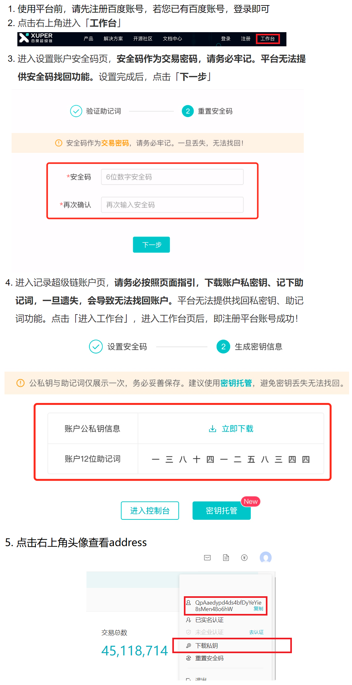  

### 充值

`Tip:用户地址下需要有百度开放网络余额才能使用转移资产，查询余额等功能。建议在百度开放网络充值0.1元。充值链接：`https://xuper.baidu.com/n/console#/finance/wallet/recharge  
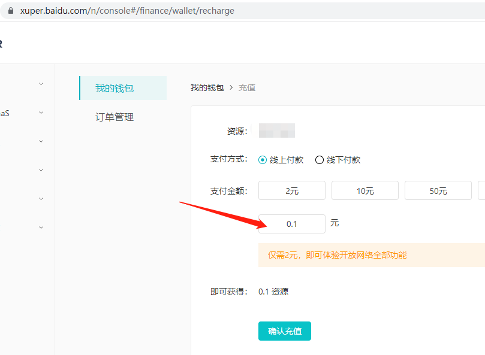

## 安装

钱包插件已放置根目录下  

1. 浏览器选择管理扩展程序

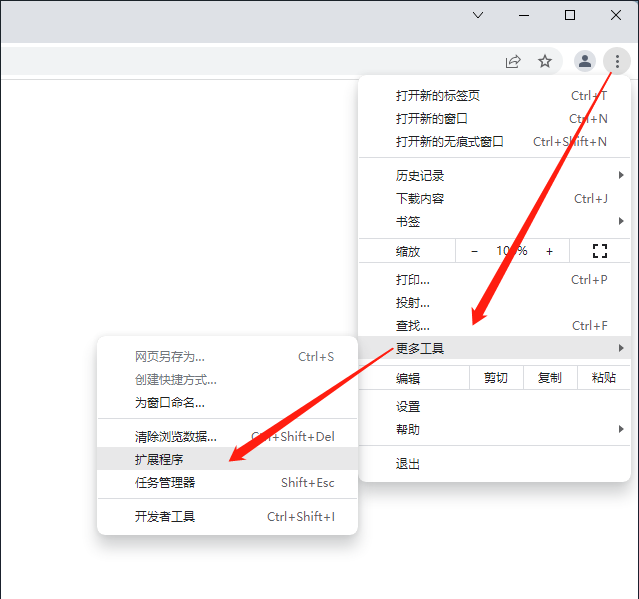  

2. 首先打开开发者模式，然后解压下载的压缩包并选择加载，此时您可以看到浏览器已经安装好该钱包插件了  
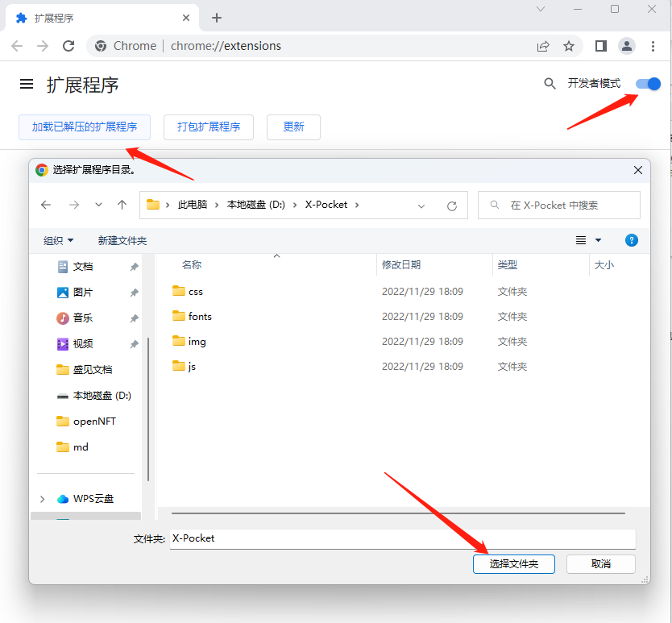  
3. 您可以选择钱包插件常驻
  

## 使用

### 登录
下载私钥到本地之后，打开浏览器钱包插件进入登录页，可以选择链类型：百度超级链、以太坊：  

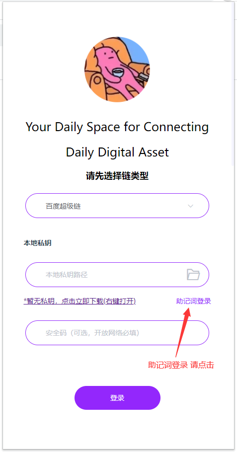  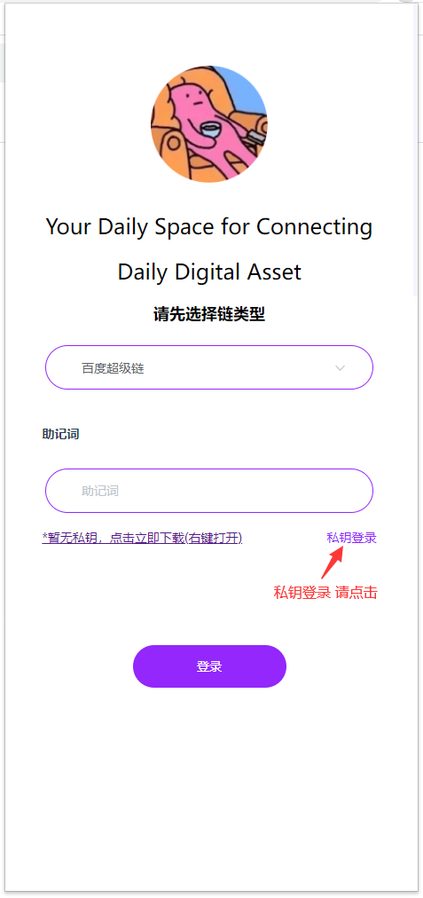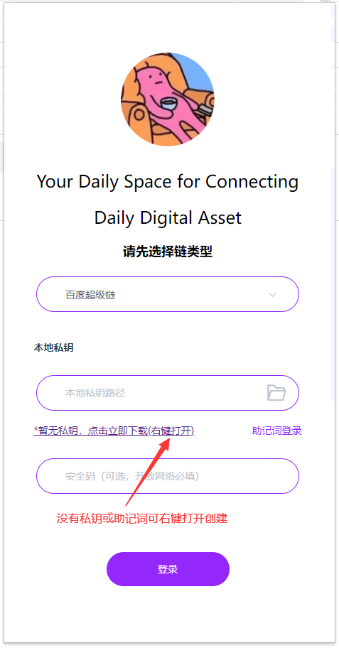 

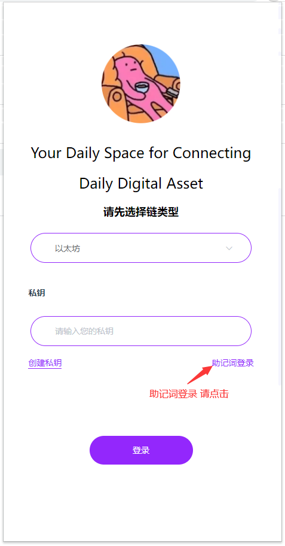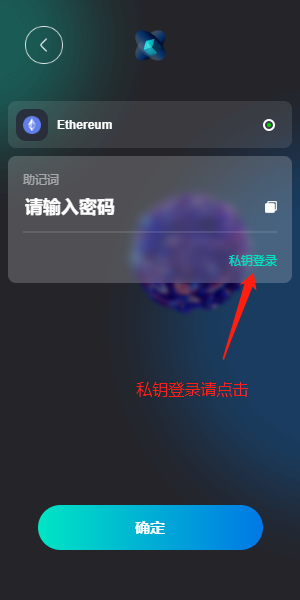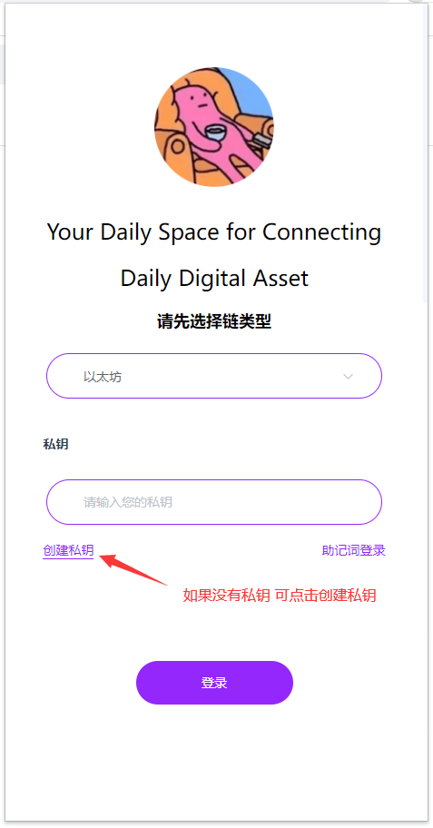

### 首页

展示钱包余额、网络选择、查询功能、转移功能、插件市场以及NFTs和Tokens资产   
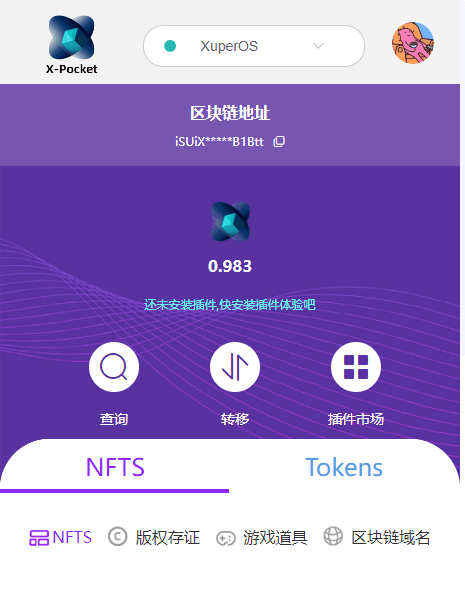 

### 个人中心
切换账户，创建新账户，设置菜单  
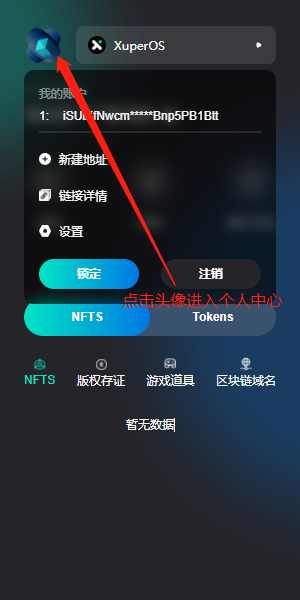 

### 自定义操作

首页==>点击查询进入自定义操作

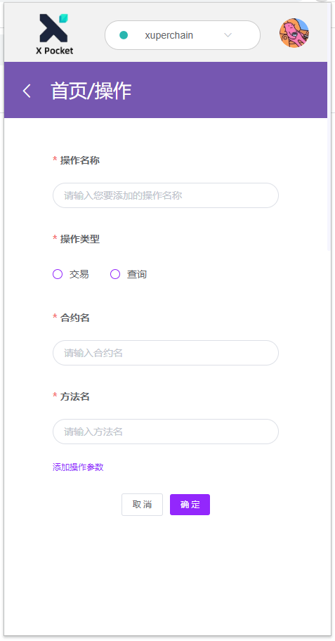 

### 转移  

首页==>点击转移 键入转移操作

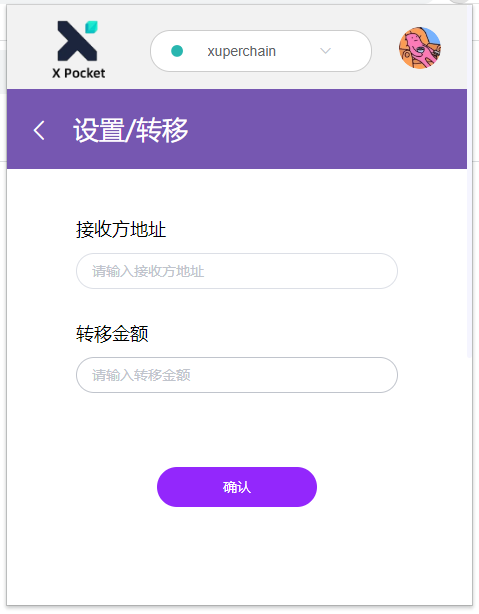 

### 插件市场
可以安装插件，安装插件后可以展示插件功能并执行  
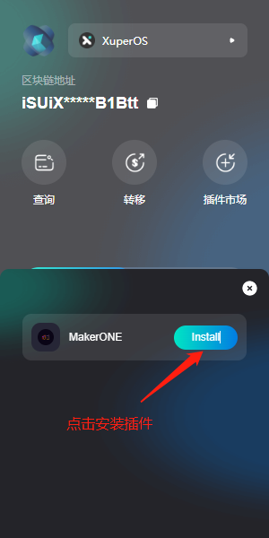  

插件首页

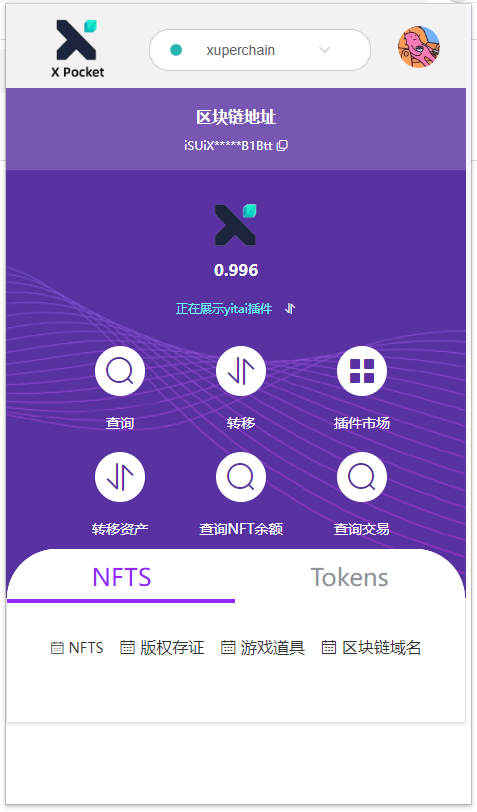  

插件功能

 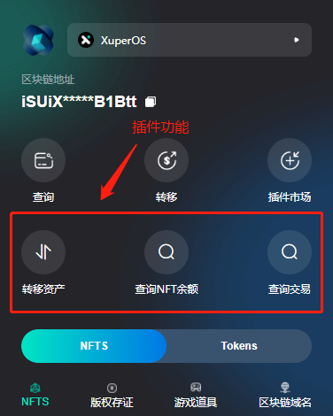

切换插件

 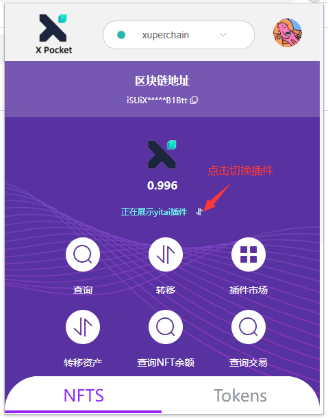

通过插件查询NFTS

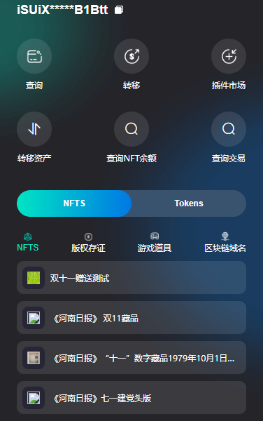  

点击NFT查看详情

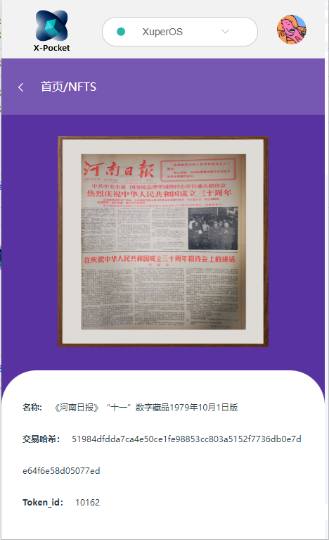  

Tokens

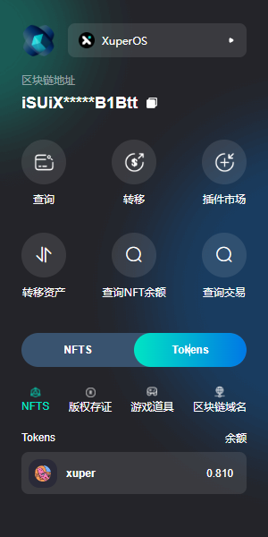  

### 设置
包含管理网络  
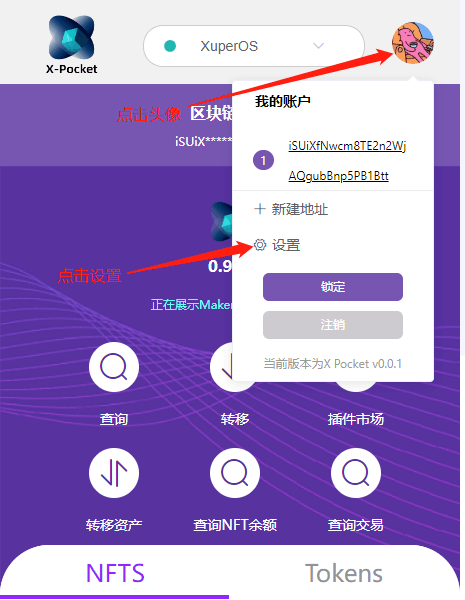 

管理网络

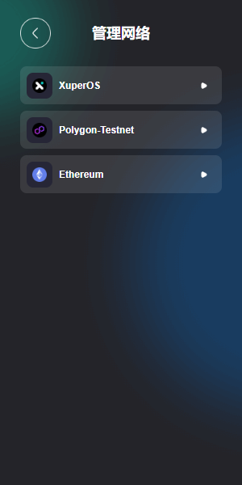  

点击网络 查看网络

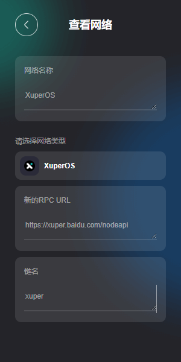 

## 插件规范说明

