多链钱包 支持XuperChain、以太坊

## XuperOS/开放网络 前期准备

### 注册账号以及获取私钥

访问 https://xuper.baidu.com  百度开放网络  
  

### 充值

`Tip:用户地址下需要有百度开放网络余额才能使用转移资产，查询余额等功能。建议在百度开放网络充值0.1元。充值链接：`https://xuper.baidu.com/n/console#/finance/wallet/recharge  


## 安装

钱包插件已放置根目录下  

1. 浏览器选择管理扩展程序

  

2. 首先打开开发者模式，然后解压下载的压缩包并选择加载，此时您可以看到浏览器已经安装好该钱包插件了  
  
3. 您可以选择钱包插件常驻
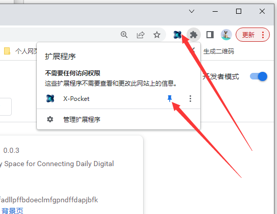  

## 使用

### 登录
下载私钥到本地之后，打开浏览器钱包插件进入登录页，可以选择链类型：XuperOS、Ethereum：  

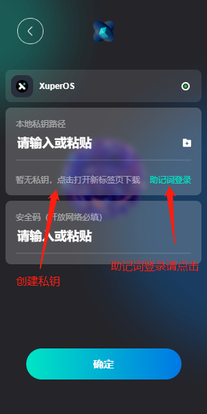   

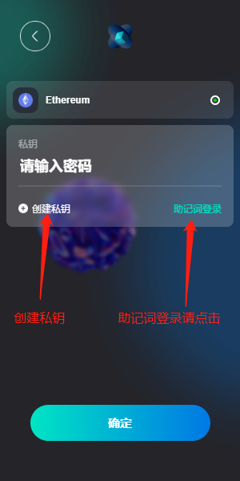

### 首页

展示钱包余额、网络选择、查询功能、转移功能、插件市场以及NFTs和Tokens资产   
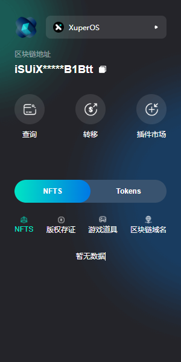 

### 个人中心
切换账户，创建新账户，设置菜单  
 

### 自定义操作

首页==>点击查询进入自定义操作

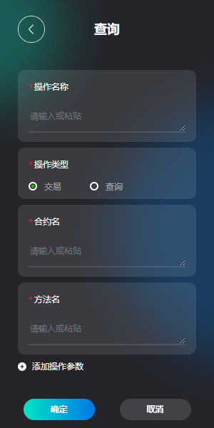 

### 转移  

首页==>点击转移 键入转移操作

 

### 插件市场
可以安装插件，安装插件后可以展示插件功能并执行  
  

插件首页

  

插件功能

 

切换插件

 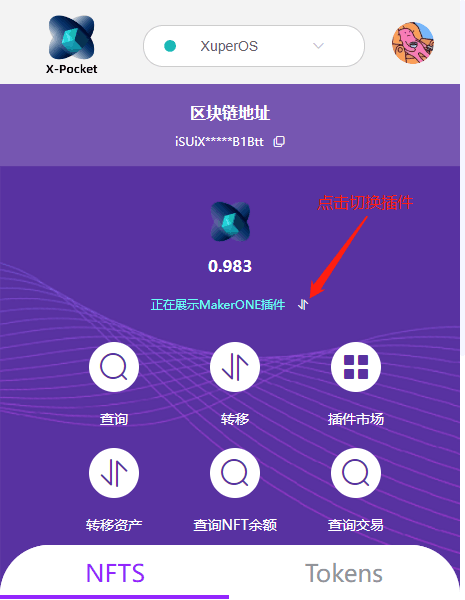

通过插件查询NFTS

  

点击NFT查看详情

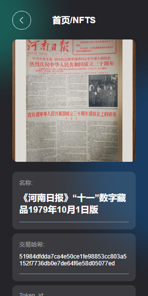  

Tokens

  

### 设置
包含管理网络  
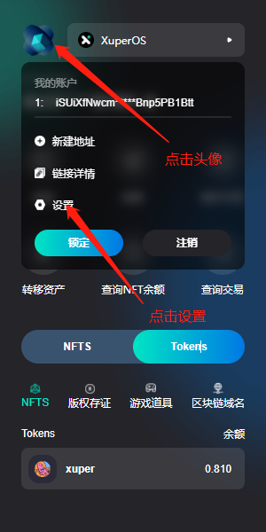 

管理网络

  

点击网络 查看网络

 

## 钱包授权说明
### 钱包唤醒  
#### 1.以太坊链  
在网页试图连接以太坊链时，会直接唤醒钱包。  

```js
let accounts = await ethereum.request({method: "eth_requestAccounts"});
```

#### 2.XuperChain

在网页试图连接XuperChain时，会直接唤醒钱包。  

```js
let accounts = await xuper.request({method: "eth_requestAccounts"});
```

### 钱包授权
在网页首次链接钱包时，会进入钱包的授权页  
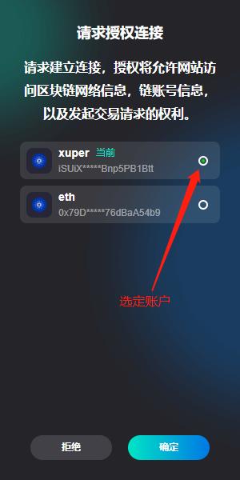    

### 钱包授权详情
在网页首次链接钱包时，会进入钱包的授权页  
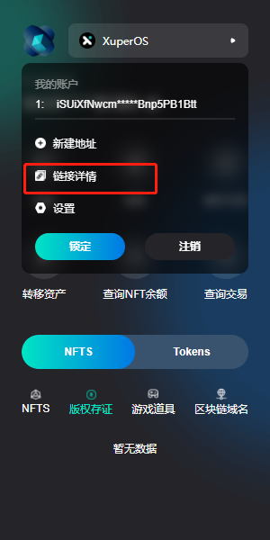    
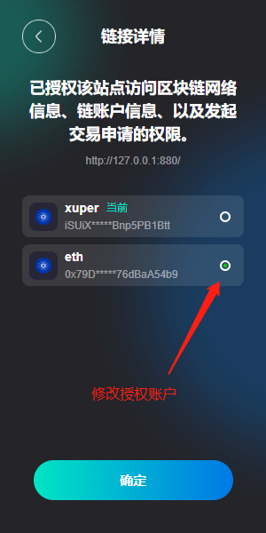    


## 插件规范说明
### 插件合约

>#### 1.合约部署
>
>>由于插件ID 是在合约内部自增， 需要提供插件 ID 初始值。
>
>```solidity
>// 合约初始化 插件id 的起始值
>constructor(uint256 id) {
>   owner = msg.sender;
>   pluginID = id;
>}
>```
>
>#### 2.添加审核插件信息的审核者
>
>>此方法只能由合约部署者调用。`operater` : 审核者地址；`isApprove`: `true/false` 是否授权
>
>```solidity
>function setController(address operater, bool isApprove)public ownerOnly{}
>```
>
>#### 3.注册插件（添加插件信息
>
>>注册没有权限限制，谁都可以调用。注册的插件需要审核后才能被查询到。
>
>>`possessor`: 插件拥有者；`name`: 插件名称，链上唯一 ; `desc`: 插件描述； `data`: 插件数据（一般为JSON字符串）
>
>>`typeName`: 插件类型    `version`: 插件版本   `logo`: 插件logo
>
>>returns: 返回插件ID
>
>```solidity
>function addPluginInfo(address possessor,string memory name, string memory desc, string memory data, string memory typeName, string memory version, string memory logo) public returns (uint256) {}
>```
>
>#### 4.插件审核
>
>>审核者对插件进行审核通过
>
>>`pluginId`:插件ID
>
>```solidity
>function checkPlugin(uint256 pluginId) public controllerOnly {}
>```
>
>#### 5.修改插件信息 （只能由插件信息拥有者即注册人  修改）
>
>>`pluginId`： 插件ID；`desc`: 插件描述； `data`: 插件数据（一般为JSON字符串）
>
>>`typeName`: 插件类型    `version`: 插件版本   `logo`: 插件logo
>
>```solidity
>function updatePlugin(uint256 pluginId, string memory desc, string memory data, string memory typeName, string memory version, string memory logo) public {}
>```
>
>#### 6.查询插件信息
>
>>可以根据插件ID 或者 名字 查询插件
>
>>`pluginId`: 插件ID； `pluginName`: 插件名称
>
>>`id`: 插件ID； `name`: 插件名称 ； `desc`: 插件简述； `logo` : 插件logo
>
>```solidity
>function getPluginById(uint256 pluginId) public view returns (uint256 id, string memory name, string memory desc, string memory logo) {}
>
>function getPluginByName(string memory pluginName) public view returns (uint256 id, string memory name, string memory desc, string memory logo) {}
>```
>
>#### 7.查询所有插件ID
>
>>查询所有插件ID （审核通过的）
>
>>returns: 所有已审核过的插件ID
>
>```solidity
>function allIds() public view returns (uint256[] memory) {}
>```
>
>#### 8.删除插件（只有审核者可以调用）
>
>>修改插件审核状态为 false。不能被查询到。 `pluginId`: 插件ID
>
>```solidity
>function deletePlugin(uint256 pluginId) public controllerOnly {}
>```


### 插件的JSON格式
```json
{
  "addList": [
    // 功能操作合集
    {
      "name": "转移资产", //操作名称
      "icon": "el-icon-sort", // 操作icon，图标地址:https://element.eleme.io/#/zh-CN/component/icon
      "type": "transaction", // 操作类型，query查询，transaction交易转移等
      "formValue": [
        //操作参数
        {
          "label": "来源账户Address",
          "value": "from"
        },
        {
          "label": "接受者账户Address",
          "value": "to"
        },
        {
          "label": "资产ID",
          "value": "id"
        },
        {
          "label": "编号",
          "value": "sonId"
        },
        {
          "label": "数量",
          "value": "amount"
        },
        {
          "label": "额外数据",
          "value": "data"
        }
      ],
      "methodName": "safeTransfer", //操作方法，合约方法。针对xuper
      "contractName": "makerone", //合约名
      "txType": "1", //是否需要调用合约方法，1，需要，0 不需要 只需要调用固有api
      "search": "transaction" //api取值参数，解析xuper 中 xsdk.queryTransaction的结果内容。
    },
    {
      "name": "查询NFT余额",
      "icon": "el-icon-search",
      "type": "query",
      "formValue": [
        {
          "label": "资产ID",
          "value": "id"
        },
        {
          "label": "资产编号",
          "value": "sonId"
        },
        {
          "label": "查询账户",
          "value": "from"
        }
      ],
      "methodName": "getTokenBalance",
      "contractName": "makerone",
      "txType": "1",
      "search": "responses"
    },
    {
      "name": "查询交易",
      "icon": "el-icon-search",
      "type": "query",
      "formValue": [
        {
          "label": "交易ID",
          "value": "txId"
        }
      ],
      "methodName": "getTokenBytes",
      "contractName": "opennft",
      "txType": "0",
      "txName": "queryTransaction",
      "search": "tx"
    }
  ],
  "type": "xuper", //插件类型 xuper属于开放网络，eth属于以太坊网络
  "tabCont": [
    //首页五大模块，内容。
    [
      //nfts,
      {
        "nftsname": "MakerONE", //nfts 名称，
        "nftsurl": "https://testmakerone.shengjian.net/qianbao/api/qianbao/xuperChain/userAsserts", //请求地址，xuper是本地服务，eth是nftscan的请求连接。eg:https://restapi.nftscan.com/api/v2/account/own/0xca1257ade6f4fa6c6834fdc42e030be6c0f5a813?erc_type=erc721
        "xapikey": "PbTZQvKNwCJWA2nAuQyFELrS", //nftscan 请求头的header X-API-KEY 字段。
        "contract_address": "makerone" //资产的 NFT 合约地址
      }
    ],
    [],
    [],
    [],
    []
  ]
}
```


